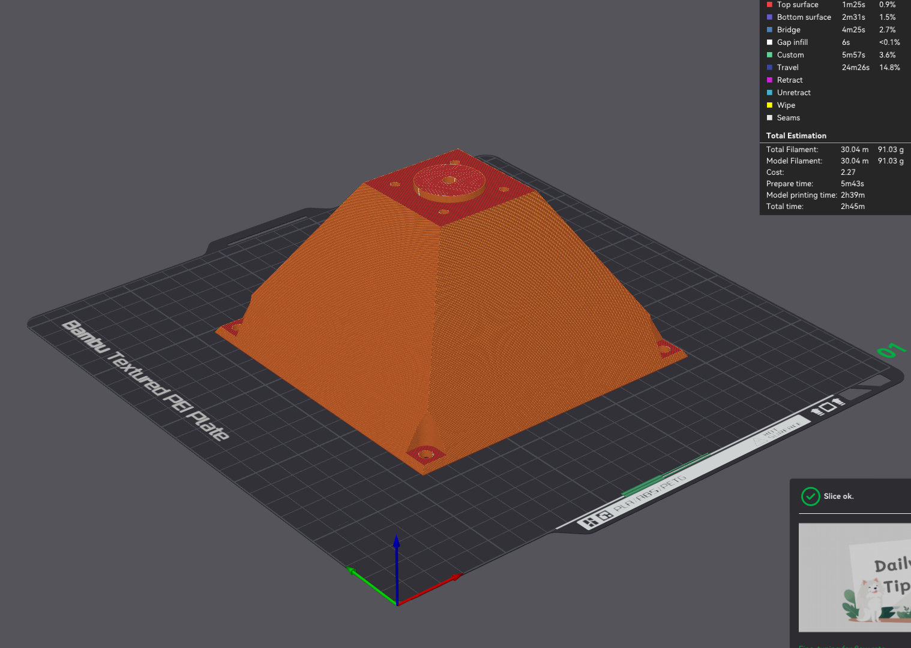
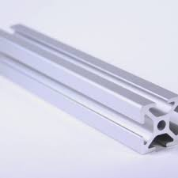
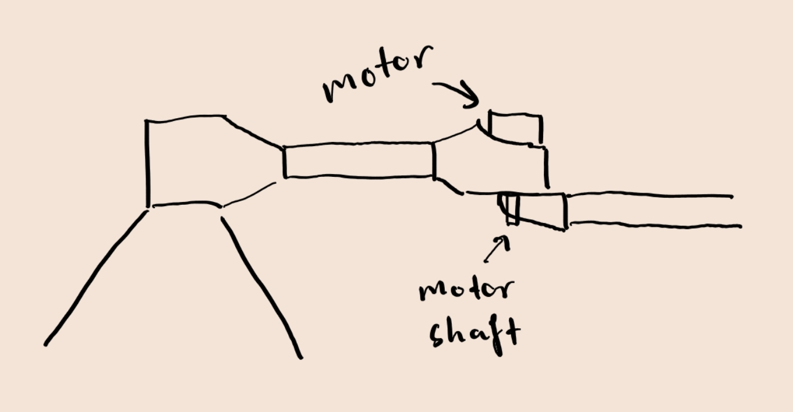

I recently made this vision-controlled pen plotter:


People seemed to like it and were asking about it, so I thought I'd write about it here! 

# Story

I recently started working as a computer vision software engineer at a [robotics company](https://www.monumental.co/). 

This is my first time working in the robotics industry, and I've been thoroughly enjoying it.
I've found it to be insanely satisfying to write code that translates into real-world, physical machines completing tasks intelligently.

Of course, this is facilitated by physical machines - hardware. Motors, electronics, springs, power converters, 3D printed creative designs, and all kinds of stuff I have never worked with before. Absolutely fascinating.

So, I decided I'd take a stab at this hardware stuff in my free time.

The project I decided to go with was building a robotic pen plotter. 

Ok, so I want to make a pen plotter. The rough idea in my head was that I'd make a robotic arm with two rotating joints, like a double pendulum:


How to get started?

Well, as a starter, it's going to need motors. 


Turns out, not all motors are made equal. 

The three main options are:

* DC motors - On an interface level, these motors just spin at a speed approximately linearly correlated to the amount of current you feed them.


* Servo motors - You can command these motors to turn the shaft to a certain angle relatively precisely.


* Stepper motors - These motors divide each rotation of the shaft into a number of steps. Then you can tell the motor to turn the shaft an exact number of steps, and it will.


I asked around at work, and turns out they had a couple of stepper motors that I could have for the project!
Stepper motors should be a fine fit because I should be able to get the motor to move $x$ degrees by figuring out how many steps add up to $x$.

The specific motors that I now had in my hands were two of these Nema 17 stepper motors:


Awesome, I got motors!

Next step must be to sketch up a basic design of the arm that works with these motors. 
Of course, the arm cannot rest on the table. 
It has to be connected to some kind of base which is then attached to some flat surface.
I decided it should look something like this:


Great! Now I need to make this design a little more precise, and somehow bring it into the physical world.

At work, a lot of components are 3D printed.
I thought "Ok, let's make this a real hobby, and buy a 3D printer"! 
So I asked around, and my coworker recommended the BambuLab A1, so I ordered one! 

While I was waiting for it to be delivered, I could work on actually making the design that I was going to print with it.
I was going to need to use Computer-Aided Design, CAD for short - something I had no experience with whatsoever.

Again, I asked around and my coworker recommended I use [Onshape](https://www.onshape.com/en/), a web-based CAD program that you can use for free, given that you don't mind your designs being public for the world to see.

So, I went ahead and started to play around with it. Of course, I ventured to the YouTube tutorials and followed along.
Designing components in CAD felt quite natural - it had that problem-solving flow I am so used to in programming.
After fiddling around for a while and iterating the design, I got a basic design going for the base of my robot!


The idea was that the motor would go into the base, and be hidden from view. 
It would be screwed into the bottom, and the shaft would pop out from the top, ready to control the arm.
I also added an opening for wires, and some screw holes so I could screw the base onto some kind of flat surface on which the plotter would draw.

Around this time, my 3D printer arrived! I assembled it - what a beauty!


How on earth do I use this thing?
Turns out I need something called a "slicer" to get my model ready for printing.
I look up which slicer I should use, and it turns out BambuLab had one of their own - Bambu studio!
I exported my part from Onshape, and loaded it into the slicer:



Turns out you can't print this part without using support structures - I turned them on, and just pressed print.
Apparently, 3D printing has come a long way, and the print went perfectly! Sadly, I did not take a photo of the freshly printed part, but I promise you'll see it a bit further down. I screwed the motor into place, and it fit perfectly! But of course, that was by design.

Now for the arms. At work, my colleagues advised me to use aluminum extrusions for the arms - these things:



Apparently, these are super useful when prototyping.
They cut two 15cm pieces of these things for me. 

I decided the next step was then to make a part that would fasten onto the motor shaft, and have a connector for the first aluminum extrusion - that would be the upper arm!
The rough idea was something like this:


Time to put on my CAD hat and design it! This was the outcome:


I printed this bad boy and assembled the parts - looks good!


Now it's time to get this motor moving. This is a part I had a lot of trouble with! 

First, the motors need electricity to move - specifically 12V. I don't have a power supply for that! So, I asked around at work, and my colleague just found a random power adapter that read 12V, cut the connector off it, stripped the wires, put some clips onto it, and handed it to me. It looked like this:


Apparently I could just connect this directly to the power terminals of the motor. I didn't know you could do that! But if it works, it works.


Now that we have power, we need to actually interface with the motor and control it. Along with the motors, my colleague gave me motor drivers. Or motor controllers, not sure which one this is. Either way, it looks like this, screwed onto the motor:


I had no idea how to use this thing, so I found some tutorials, and looked at the documentation. 
This thing apparently reads the shaft position using a magnet that is glued onto the bottom of the shaft, between the driver and the motor.
It has a PID controller (something that should be able to control the motor smoothly using the feedback of the magnet sensor), and should have a friendly interface for moving the shaft to specific positions smoothly.

So, the first step was to glue the magnet onto the shaft. Of course that went terribly, as I did not have any pliers or other handy tools available - I even destroyed one of the motors by letting glue into its mechanism.

After gluing the magnet onto the shaft, you need to use the little screen to tell the motor to calibrate:


During calibration, the shaft should rotate slowly. Mine didn't - it just jerked back and forth. Then it threw an error at me: "Reverse lookup error!". Damn. 

I looked online, and found this in the documentation:

```
* err4“Phase Line Error！”

  if it keeps show “Phase Line Error”,please adjust the 4pin motor cable wiring sequence.
```
See that little connector cable on the left in the image of the driver? Turns out I needed to reverse the connections of the two middle wires. Took me quite a while to figure out.

Ok, I've swapped the wires, let's calibrate! I connect the motor to the power supply, press "Cal", and the shaft rotates!
After about a minute, ...it still gave me the same error -_-.

I went into "screw with it until it works" mode. I took it apart, re-applied the magnet, swapped wires around, did all kinds of stuff.
After a while of this, the error finally went away! No idea why though.

But I finally got it assembled, powered up, and calibrated! Of course, the next step is then to try to control it. 
Looking at the documentation, there are three ways the motor can operate: 

* `CR_OPEN`: Means open-loop mode - in this mode, the magnet sensor and PID controller are not used - you just tell the motor to move a certain number of steps and hope for the best.
* `CR_vFOC`: In this mode, you still tell the motor to move a certain number of steps, but the driver uses the PID controller to make sure the motor moves smoothly and ends up where you want it to.
* `CR_UART`: This is Serial mode - you use a binary communication protocol to send all kinds of commands to the motor, like "move to this position at this speed", or you can ask it about the motor shaft position.

Of course, Serial mode sounds the best - I only have to supply high-level commands and the motor does what I want to!

But there's a problem. The Arduino Uno, the microcontroller I had, only had one serial interface, and I was using that for communication with my laptop - it's the interface you use to flash your programs onto the microcontroller, and communicate with it while it runs its program. Damn!

I told my colleague about this, and he provided me with an ESP32 development board:


Apparently, this thing has not one, but three serial ports - great!

I figure out which pins on the board correspond to a serial interface, and wire it up to my motor. 

Of course, some software is required to communicate with the motor over the serial interface. I go ahead and download an Arduino library for usage with the motor driver ([link](https://docs.arduino.cc/libraries/mks_servo42/)), and fire up a test program. It worked! I could control the motor shaft in my firmware!

At this point I was super happy. I just need to design the elbow and upper arm, and I should have a two-jointed arm I can control!

So, I start dreaming up designs for how the elbow will work. How do I put a stepper motor into the elbow to drive the forearm?

I know! I'll attach a little seat to the lower arm with a hole in the bottom for the shaft - then I can put the motor shaft-down into the seat, and attach the forearm under the seat!
This is sort of what I had in mind:





I put on my CAD hat again and design both the seat and the forearm attachment. The prints came out like this:


Looking pretty good! Let's get the second motor working and assemble!

I install the driver onto the second motor. This went better than the other one as I had learned a few lessons, but I still had to do a bit of magic fiddling I still don't understand.

Of course, I want to know that I can also control the second motor before assembling the whole thing. I connect it to my ESP32, and ... it doesn't work. No matter what I do, the library just prints "Invalid response from motor driver". Damn. 

I spend a lot of time debugging this. Some things I thought were wrong were:

* The motor driver was broken
* The power supply was not connected to the microcontroller's ground, which I don't understand the consequences of. 
* The serial interface pins were sharing the same interface with the one I was using to communicate with my laptop.

However, none of these issues were present with the first motor. 

Eventually (with a lot of debugging), I figure out that the drivers on the motors had different firmware versions installed - the base motor has version V1.1, but the elbow motor has version V1.0! The serial interface protocol was changed between the versions, and the library is configured to use V1.1. No wonder that the elbow motor was not working.

What I did to solve this was to patch the library to be compatible with both versions - with my modified version, you just need to specify the firmware version your driver is using.

Now I can finally control both motors, so let's assemble the thing! This is the result:


Amazing! I whipped up a simple program that would move both motors a bit back and forth, and it did - the arm moved back and forth!

As you see in the picture, I am holding the base - this is because at this point, I hadn't found a plate to attach the base to. The initial idea was that I'd figure out some flat surface that I'd simply screw the base to. But now I needed to find a plate. I asked around at work, and they had nothing to spare that worked.

So, I looked around at home - we had just moved into a place in Amsterdam, and the previous tenant left some random stuff in the apartment - maybe they left something I could use as a base plate? Yes! In the storage room, there was a stack of some kind of glass-plastic plates, about 70cmx50cm. That should work!

However, I could not drill holes into the thing - I don't have a drill, nor do I know whether the plate would actually handle it. There must be another solution to stick the base onto the plate.

Of course! I could make these things called "snap rivets". What I designed looks like this:


I'd glue four of these to the plate, and the base would just snap stuck onto them! Great, right? Not really - they work, but they were constantly breaking when I wanted to remove the base to access the motor! When that happened, I couldn't get the rest of the rivet off as I had superglued them onto the plate! At the end of the project, the base looks like this:


Screw it, it works.

The next step was to see if I could do a little more than move the motors randomly - was it stable? Could I control it precisely? Nope. It moved super janky, wiggling back and forth a lot. 

I conjectured that the motor on the elbow was way too heavy, putting a lot of leveraged force on the base shaft. I asked around at work, and they had a "pancake" version of the Nema 17 motor on hand:


This one was much lighter, so it should be a better choice. I swapped the motor driver onto it, and redesigned the elbow connector for the smaller motor.

I assembled the updated design, and again told the motors to do some stuff. But they were still super wobbly! Turns out it couldn't have been because of the weight because the forearm was also moving wobbly, and there was no real weight on it. Sometimes the motors would even start spinning uncontrollably, messing everything up around them!

After a bunch of screwing around with the motors and their settings, I figured that the PID controller in the driver was just not working correctly.

Why do I even need a PID controller? Can't I just use the open interface and tell the motor how many steps I want it to go?

I rewired the design for the open interface, modified the software, and BAM it worked - the arm was moving pretty smooth. Screw this closed-loop PID bullshit.


So, now I had an arm with two rotational joints that I could control pretty precisely. What next?

Let's make the end-effector - the attachment for the pen! 

I tried to think ahead - if I just put stick the pen onto the end of the arm, the plate needs to be super flat, and the arm absolutely straight - otherwise the pen will press too hard on the plate in some areas, and maybe even lift off the plate in some areas. So let's make it spring-mounted!

I don't have any springs - what about trying to make a 3D printed design that works like a spring? 
I ended up with this design:


Pretty cool, right? The thin pieces press against the circle, and push it down. We can then attach the pen to the mount, and we have a spring-mounted pen attachment!

To attach a pen, I made these holes in the side to use zip-ties to attach a pen:


Don't mind the tattered-up pen - I've put it on and removed it a couple of times. But this way, I could adjust and swap out pens of different shapes and sizes (at the cost of destroying some zip-ties).

I attached this onto the end of the forearm, and I finally had a pen plotter! Well, only the hardware though. There was no good way for me to tell it what to draw, and how to do it. It's software time!

If we want to be able to draw anything, we need to understand the relationship between the location of the pen, and the angle of the motors. That is, we need to work out the *kinematics* of the robot. Be warned, this is going to require some mathematics!

Let's say the center of rotation is the origin, and create a coordinate system:


Of course, we don't need such a detailed drawing of the robot in our model - let's reduce it down to a sick model:


So we need to know where the end of the forearm (the pen) is in the $x$-$y$ plane, based on the angles of the motors. 

A common method to do this is to place coordinate systems called *reference frames* on each of the joints:


Here I've marked three frames. First, we have the *base frame* $B$ as the frame of the base motor - it is the same as our *world frame*, our main coordinate system. Next, there is the *elbow frame* $E$ as the frame of the elbow motor. Finally, we have the *pen frame*, which is centered at the pen.

Let's also add the motor angles and the arm lengths into the picture:


The next step here is to figure out how we go from $B$ to $E$, and from $E$ to $P$. This involves a bit of linear algebra, but the gist is that to get from $B$ to $E$, we can first rotate the $B$ frame by $\theta_1$, and then move it by $l_1$ along its (new) $x$-axis. Similarly, we can get from $E$ to $P$ by rotating $E$ by $\theta_2$, and moving $l_2$ along the $x$-axis of the updated $E$ frame.

Working through the math, the final result is that the pen location $p$, the center of $P$, is
$$
p = \begin{bmatrix}
l_1 \cos(\theta_1) \sin(\theta_2) - l_1 \sin(\theta_1) \sin(\theta_1) + l_2 \cos(\theta_1)\\
l_1 \sin(\theta_1) \cos(\theta_2) + l_1 \cos(\theta_1) \sin(\theta_1) + l_2 \sin(\theta_1)\\
\end{bmatrix}
$$

A bit of a mouthful, but we have it!

Now I can pick a value for $\theta_1$ and $\theta_2$, and know where the robot will end up! The values of $\theta_1$ and $\theta_2$, concatenated into a vector $\boldsymbol{\theta}$ is called the *configuration* of the robot, and the function from the configuration to the position of the pen is called the *forward kinematics*.

Here is an implementation of the forward kinematics in a python function:

```python
def forward_kinematics(configuration: np.ndarray, l1: float, l2: float) -> np.ndarray:
    theta_1, theta_2 = configuration

    return np.array(
        [
            L1 * np.cos(theta) * np.cos(phi) - L1 * np.sin(theta) * np.sin(phi) + L2 * np.cos(theta),
            L1 * np.sin(theta) * np.cos(phi) + L1 * np.cos(theta) * np.sin(phi) + L2 * np.sin(theta),
        ]
    )
```

This is not too useful on its own - I don't want to go from angles to locations, I want to input a pen location, and get a configuration that puts the pen in the correct place! This is called the *inverse kinematics*.

I think the simplest way to do this is to use optimization. I'll define a cost function that accepts a configuration and a target location, and spits out how far the pen is from the target location:

```python
def objective(configuration: np.ndarray, target: np.ndarray, l1: float, l2: float) -> float:
    pen_location = forward_kinematics(configuration, l1, l2)
    return np.linalg.norm(pen_location - target)
```

Then I just use `scipy.optimize` to optimize this objecctive!

```python
def inverse_kinematics(target: np.ndarray, l1: float, l2: float) -> np.ndarray:
    result = minimize(
        objective,
        np.array([0, 0]),  # dumb initial guess
        args=(target, l1, l2),
        method="SLSQP",
        bounds=[(-np.pi / 2, np.pi / 2), (-3 * np.pi / 4, 3 * np.pi / 4)],  # Joint limits
    )

    return result.x 
```

With slight modifications to make sure the robot takes the shortest path to each next point, I could generate some points, and find where the plotter needs to go to draw the points!


I copied the list of configurations into the Arduino code, and it worked!


As you can see, I'm drawing on a piece of paper, which is pretty lame. Ideally, the whole plate area would be a whiteboard the plotter could draw on. 

This was not so complex to solve - I just bought some whiteboard film, and stuck it on the plate:


Now the robot has much more room to draw! I played a lot with the robot in this state, copying and pasting angles into the firmware for the robot to draw.

An annoying thing now is that the robot cannot lift the pen. The whole drawing has to be done in one pen stroke. Let's fix this! 
I had a small servo motor on hand, and thought it would be perfect to lift the pen! I redesigned the pen holder to accommodate a servo motor that could lift the pen up - this is the result:


The mechanism is simple - I put a plate on the stick that the servo pushes up to lift the pen, and releases to put the pen down. This actually did not take me very long, which was a pleasant surprise!

As you can also see, I also removed the "spring" mount - turns out the weight of the pen is enough downwards pressure. 

The only problem here was that the servo required 5V, but I only had 12V from my power supply, and 3.3V from my ESP32. However, the only reason I switched to the ESP32 in the first place was that I needed the extra serial ports that I was not using anymore. So, I switched back to the Arduino, which has a 5V output pin!

To be able to draw interesting things, created a communication protocol over serial that I could use to stream some commands to the Arduino from my laptop. `PD` and `PU` mean "pen down" and "pen up", `M a b` mean "move to configuration $[a, b]$", and `H` means "go to home position", which is straight forward with pen up.


Now was the question: what should I tell the plotter to draw? I don't want to sit here and define a sequence of points by hand, so how can we generate drawings for the robot?

I decided it would be cool if I could draw in the air with my fingers, and the robot would actually draw the same drawing on the whiteboard! 

I can use my webcam to capture my finger air drawings, but I'll need a way to know where my hands are. For this, we can use an out-of-the box solution: [MediaPipe hand detection](https://mediapipe.readthedocs.io/en/latest/solutions/hands.html). To draw, I decided that I'd draw with my right index finger, and indicate when I wanted the pen down by touching my left index finger to my thumb. I also wanted to signify the end of a drawing - touching the fingertips of your index fingers should do.

I whipped up a script that implemented this, and voila! We get the result you see at the top of the post!

For anyone interested, here is a [link](https://cad.onshape.com/documents/bdb48f7c4f70c2571c2f3ed1/w/ffb41e5567e0a03980d31e0f/e/92ed5e044ae3405a64fbbf65?renderMode=0&uiState=6758c448b9d28f2f0c499b29) to my CAD design in Onshape.